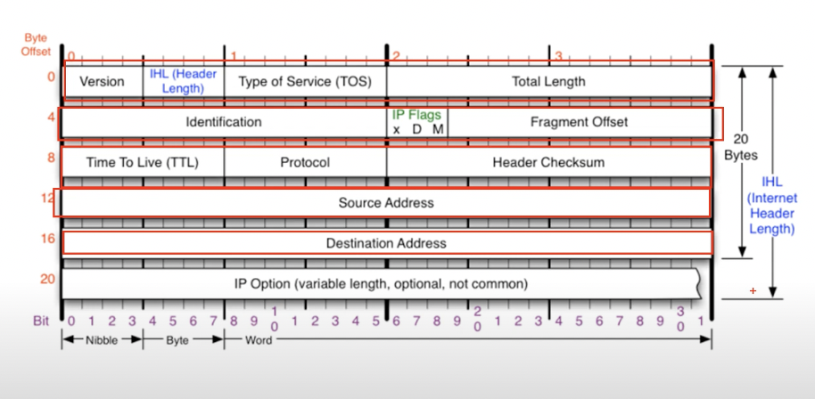
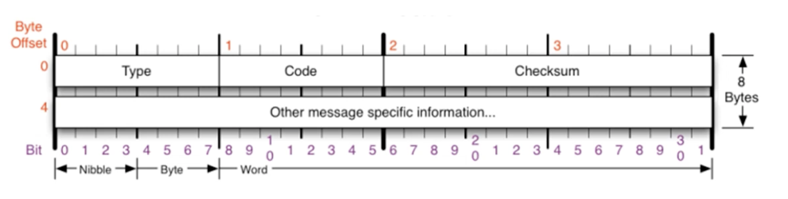
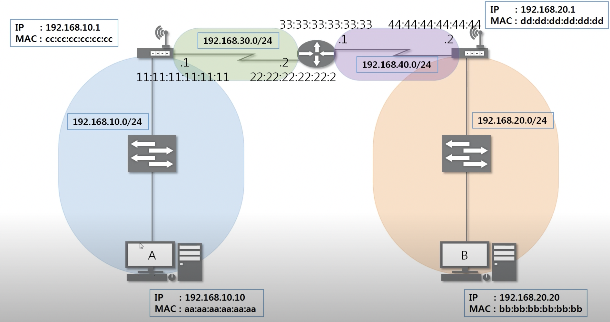
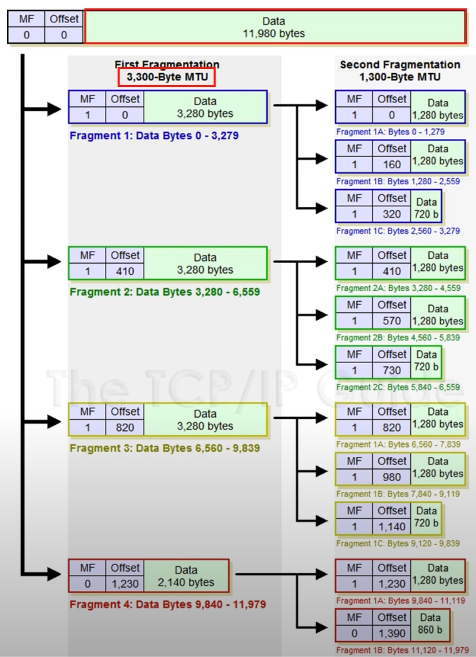

# 💡 멀리 있는 컴퓨터끼리 데이터를 주고 받는 방법

멀리 있는 곳까지 어떻게 찾아갈 것인지?

### INDEX

1. IPv4 프로토콜: IPv4가 하는 일 / IPv4 프로토콜의 구조
2. ICMP 프로토콜: ICMP가 하는 일 / ICMP 프로토콜의 구조
3. Routing Table: 내가 보낸 패킷은 어디로 가는가?
4. 다른 네트워크와 통신과정: 다른 네트워크까지 내 패킷의 이동 과정
5. IPv4 조각화: 조각화란? / 조각화 하는 과정

## 1. IPv4 프로토콜(멀리 있는 곳에서 전달만 하는 역할임)

- 네트워크 상에서 데이터를 교환하기 위한 프로토콜
- 진짜 웃긴게 `데이터가 정확하게 전달될 것을 보장하지 않는다.`(데이터가 깨질수도 누락될 수도 있음)
- 중복된 패킷을 전달하거나 패킷의 순서를 잘못 전달할 가능성도 있음
  - 이거 악의적으로는 DoS 공격이 됨
- 데이터의 전확하고 순차적인 전달은 그보다 당위 프로토콜인 TCP에서 보장한다.

5층이 있고 마지막에는 붙을지 말지 Option이다. 그래서 20byte로 구성됨 이게 옵션이 추가로 계속 붙으면 최대 60byte까지 붙는다고 한다.

- Source Address: 출발지 IP 주소

- Destination Address: 목적지 IP 주소

- version은 4가 옴 / IHL(Header Length) 최소 20byte 최대 20byte임 근데 여기 보면 4비트로 표현하고 있어서 15까지 숫자로 표현이 가능한데 60까지는 표현이 불가능하니까 4로 나눈 몫을 쓰게 됨

- type of service는 00으로 비워둠(사용하지 않음)

- Total length: header+payroad까지 -> 전체길이임

- identification(id 값) 

- IP flag(x, D, M[실제로 쓰는 건 M말고 없음 / 한 번 보내면 0, 여러 번 쪼개서 보내면 1임])

- fregment offset 조각된 데이터에 index를 부여해서 데이터 순서에 맞지 않게 보내더라도 이를 통해 조각화된 데이터를 다시 맞출 수 있도록 해줌
- 이층에서는 실제로 identification + IP flag + fregment offest 이렇게 더해져서 보내지게 됨

- TIME TO LIVE: 패키지가 살아있을 수 있는 시간 (잘못된 전송이 계속될 경우 패킷이 네트워크 상에 계속 존재하면 안됨. 그래서 그 한계를 정해놓은 것 그래서 이런 한계치가 넘어가면 해당 패킷을 버리게됨 | 참고로 운영체제마다 TTL을 정하는 값이 다름 | 장비가 넘어가면 제한이 1씩 감소함)
- TTL로 상대방의 정보를 수집할 수 있음.
- Protocol: 상위 타입을 알려줌 (ICMP(3계층), TCP, UDP(4계층))
- headerCheckSum: header가 오류가 있는지 없는지 확인하는 값

## 2. ICMP 프로토콜

ICMP(Internet Control Message Protocol, 인터넷 제어 메세지 프로토콜)

네트워크 컴퓨터 내에서 오류 메세지를 전송 받는 데 주로 쓰인다.

프로토콜 구조의 Type과 Code를 통해 오류메세지를 전송받는다.

Type: 카테고리 

|           0, 8           |                            3, 11                             |  5   |
| :----------------------: | :----------------------------------------------------------: | :--: |
| Echo \| 0: 응답, 8: 요청 | 잘못됐을 때 \| 3: Destination Unreachable(못감, 경로가 문제) 11: Time Exceded(응답을 못받음, 상대방이 문제) | 보안 |

Code: Type의 소분류

## 3. Routing Table

- 어디로 보내야할지 설정되어 있는 테이블 (여기에 적힌 네트워크 대역만 보낼 수 있음. 없으면 못 보냄, 지도가 있어야지만 찾아갈 수 있는 것과 같음 없으면 못감)

1. A에가 자신의 라우팅 테이블을 확인해봄
2. 이때 B의 네트워크 대역이 A가 갖고 있어야지만 통신할 수 있음
3. 있으면, A가 Eth + IPv4 + ICMP(08 00 4d 56) 요청(type=8)을 함
4. 여기서 중요한게 우리가 B한테 가니까 B의 MAC주소를 적어서 보내줘야하는지 아는데, 그게 아니라 Eth에서 가까운 MAC주소를 적어서 보내주게됨(정말 중요!).
5. 이런식으로 반복해서 이터넷 프로토콜을 짜주는 형태로 A와 B가 통신하게 됨

## IPv4 조각화: 여러 개의 패킷으로 조각화된 패킷

큰 IP 패킷들이 적은 MTU(Maximum Tranmission Unit)를 갖는 링크를 통하여 전송되려면, 여러 개의 작은 패킷으로 쪼개어/조각화 되어 전송되어야 한다.

즉 목적지까지 패킥을 전달하는 과정에 통과하는 각 라우터마다 전송에 적합한 프레임으로 변환이 필요하다.

일단 조각화되면 최종 목적지에 도달할 때가지 재조합되지 않는 것이 일반적이다.

IPv4에서는 발신지 뿐만 아니라 중간 라우터에서도 IP 조각화가 가능하다.

IPv6는 IP 단편화가 발신지에서만 가능하다.

하지만 재조립은 항상 최종 수신지에서만 가능하다.

현재 보내려는 데이터의 크기가 11,980bytes 인데 이를 하번에 보낼 수가 없으니까. 최소 전송단위인 3,280btyes로 나눠서 보내게 됨. 이때 3280bytes에서 1,280 + 1,280 + 720 씩 나눠서 보냄 IPv4 20byte + Ethernet 14byte. 따라서 MTU에서 해당 부분을 뺀 나머지로 계산해ㅌ야함.

