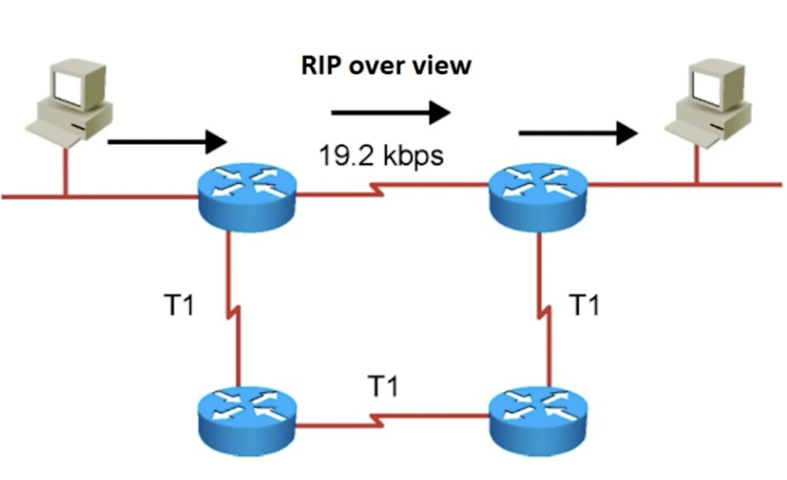

# 💡컴퓨터의 프로그램끼리는 이렇게 데이터를 주고 받는다.

이 역할은 4계층에서 담당함

1. 4계층 프로토콜
2. 포트번호
3. 프로그램의 연결 정보

## 계층 프로토콜

4계층을 전송 계층이라고도 불리며, 송신자의 프로세스와 수신자의 프로세스를 연결하는 통신 서비스를 제공한다.

전송 계층은 연결 지향 데이터 스트림 지원, 신뢰성, 흐름 제어 그리고 다중화 같은 편리한 서비스를 제공한다.

전송 프로토콜 중 가장 잘 알려진 것은 `연결 지향 전송 방식을 사용하는 전송 제어 프로토콜(TCP: Transmission Control Protocol)`가 있다. 보다 단순한 전송에 사용되는 `사용자 데이터그램 프로토콜(UDP: User Datagram Protocol)`도 있다.

UDP: 비연결 지향 프로토콜(연결되어 있는 것을 별로 좋아하지 않음), 따라서 연결에 상관없이 그냥 데이터를 전송함.

TCP: 안전한 연결을 지향하는 프로토콜, 잘받았는지 못받았는지 확인하면서 데이터를 보내게됨. 잘받으면 다음걸 보내고, 못받으면 해당 데이터를 다시 보내는 형태

## 포트 번호

특정 프로세스와 특정 프로세스가 통신하기 위해서 사용한다.

하나의 포트는 하나의 프로세스에서만 사용이 가능하다.

하나의 프로세스가 여러 개의 포트를 사용하는 것은 가능하다.

포트 번호는 일반적으로 정해져있지만, 무조건 지켜야하는 것은 아니다.(일반적으로 웹포트는 80번으로 정해져있지만, 꼭 80번을 사용해야하는 것은 아니다.) 프로그램이 사용하는 주소임! 컴퓨터가 사용하는 주소 아님.

### Well-Known 포트

| 서비스 이름 | 포트 번호 |
| :---------: | :-------: |
|     FTP     |  20, 21   |
|     SSH     |    22     |
|   TELNET    |    23     |
|     DNS     |    53     |
|    DHCP     |  67, 68   |
|    TFTP     |    69     |
|    HTTP     |    80     |
|    HTTPS    |    443    |

### 조금은 유명한 Registered 포트

|   서비스 이름    | 포트 번호 |
| :--------------: | :-------: |
|  오라클 DB 서버  |   1521    |
|    MySQL 서버    |   3306    |
| MS 원격 데스크탑 |   3389    |

### 일반 사용자들이 사용하는 Dynamic Port

| 시작 포트 번호 | 마지막 포트 번호 |
| :------------: | :--------------: |
|     49152      |      65535       |

이중에 아무거나 써서 연결한다고 함.

ex)

Chrome browser(49152) ←→ 네이버(80)

결국 통신이라는건 2, 3, 4 계층 다 써야지 통신이 된다.

## UDP프로토콜

사용자 데이터그램 프로토콜(UDT, User Datagram Protocol)

---

프로세스: 메모리에서 동작되는 프로그램은 유니버셜 데이터그램 프로토콜(Universial Datagram Protocol)이라고 부르기도 한다.

UDP의 전송방식은 너무 단순해서 서비스의 신뢰성이 낮고 데이터그램 도착 순서가 바뀌거나 뒤바뀌거나, 중복되기도 한다.

심지어 통보없이 누락되기도 한다. 따라서 UDP는 오류의 검사와 수정이 필요없는 프로그램에서 수행하는 것을 반복한다.

UDP 구조: sourcePort + DestinationPort + Length + CheckSum → 8 Bytes

도메인을 물으면 IP를 알려주는 DNS(Domain Name System) 서버

### TFTP Server

UDP로 파일을 공유(전송, 응답)하는 프로그램

